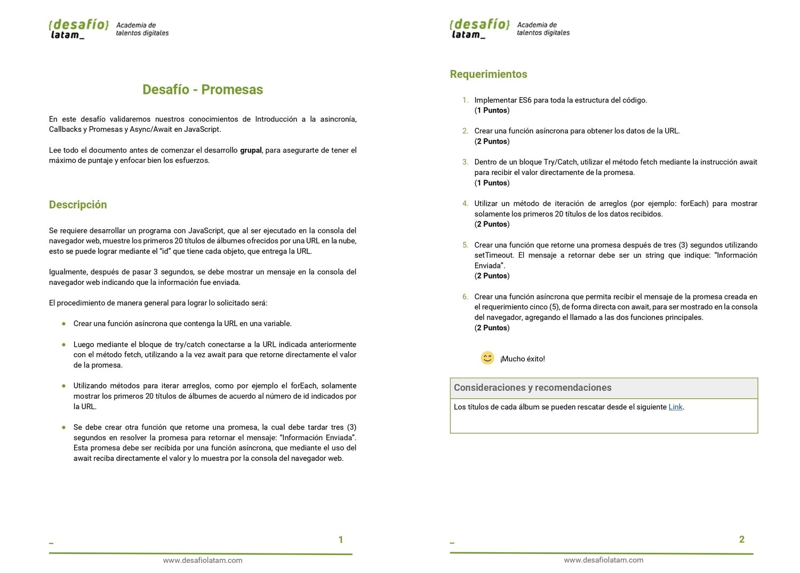
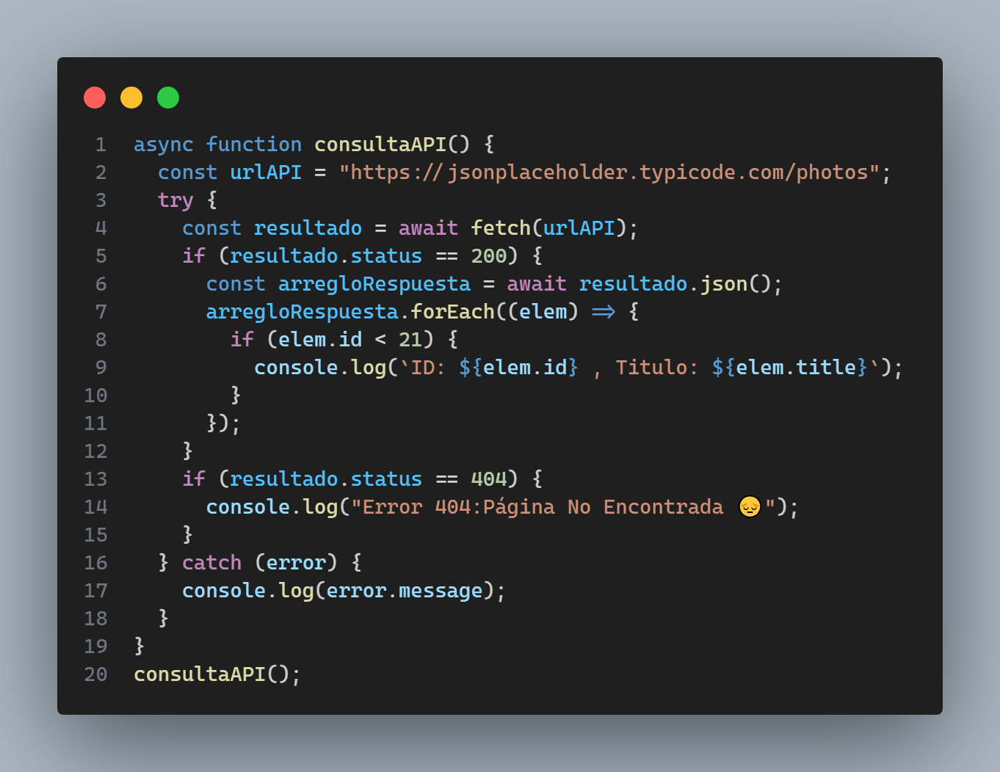
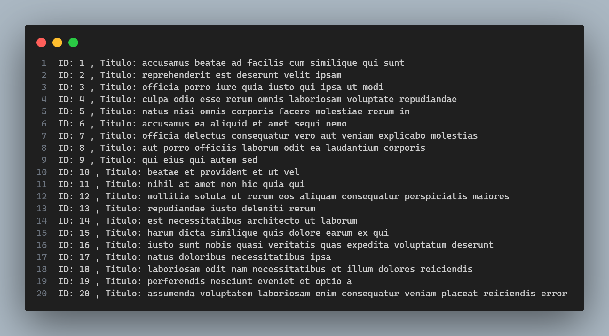
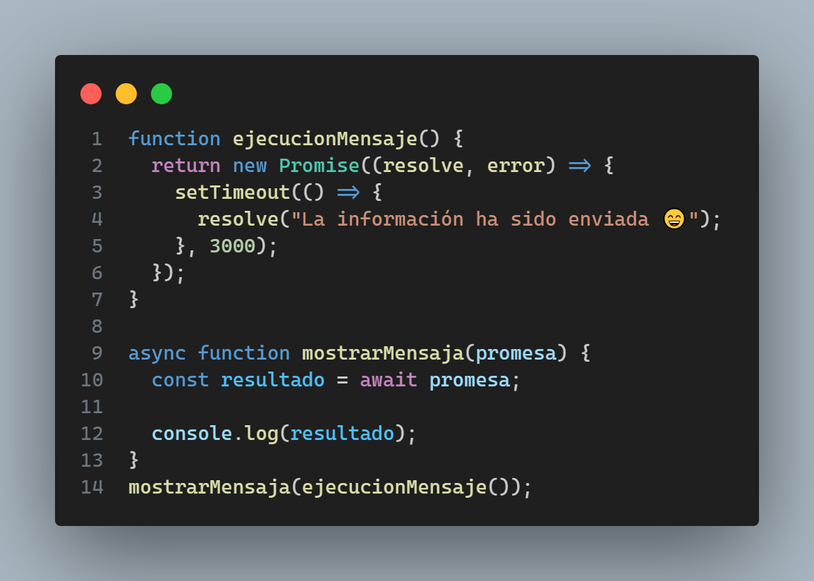
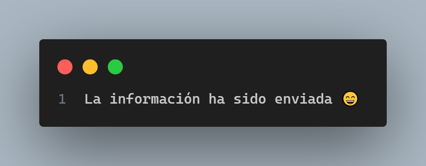

Este repositorio contiene el código del **desafío quinto** llamado **Desafío - Promesas** del módulo 4 **Programación avanzada en JavaScript** de la beca **Desarrollo de aplicaciones Full Stack Javascript Trainee** dictada por Desafío Latam. El desafío consiste en los requerimientos que muestro a continuación:

Siguiendo el procedimiento señalado en los requerimientos procedo a mostrar el código:

● Crear una función asíncrona que contenga la URL en una variable

● Luego mediante el bloque de try/catch conectarse a la URL indicada anteriormente con el método fetch, utilizando a la vez await para que retorne directamente el valor de la promesa.

● Utilizando métodos para iterar arreglos, como por ejemplo el forEach, solamente mostrar los primeros 20 títulos de álbumes de acuerdo al número de id indicados por la URL.

La siguiente función asíncrona cumple con lo solicitado:

El resultado de ejecutar la función asíncrona se muestra en consola y corresponde a la siguiente imagen:

Por último, el último requisito es el siguiente:

● Se debe crear otra función que retorne una promesa, la cual debe tardar tres (3) segundos en resolver la promesa para retornar el mensaje: “Información Enviada”. Esta promesa debe ser recibida por una función asíncrona, que mediante el uso del await reciba directamente el valor y lo muestra por la consola del navegador web.

Lo anterior lo implemento como muestro en la siguiente imagen:

Al ejecutar la función asíncrona **mostrarMensaja** con el argumento igual a la llamada de la función **ejecucionMensaje** se muestra en consola el siguiente mensaje a los 3 segundos:

